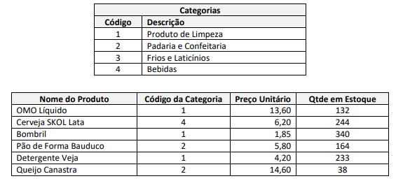

# Descrição das atividades: 

1. Faça um programa que defina uma estrutura contendo o Nome, Mail, Data de Nascimento e Telefone de um Aluno.
Insira dados de exemplo nessa estrutura e depois liste seu conteúdo.

2. Repita o exercício anterior, definindo também uma estrutura para suportar o campo Data de Nascimento, que deverá
conter os subcampos Dia, Mês e Ano.

3. Faça uma adaptação no programa feito no exercício 2 para que ele: 

a ) Suporte a entrada dos dados de 50 alunos (para testar, use os dados de 5 alunos). Use um vetor de
estruturas para isso;

b ) Liste todos os alunos cadastrados através de uma função específica que receba o vetor de estruturas
como parâmetro.

4. Faça um programa que crie uma classe contendo os dados de um filme em DVD de uma locadora (nome do filme,
duração, nome do diretor, categoria de filme e outras informações de interesse). Depois disso,

a ) Digite informações referentes a 5 filmes;

b ) Liste todos os filmes cadastrados anteriormente;

c ) Liste os filmes que pertencem a uma determinada categoria em particular, fornecida pelo usuário.

5. Uma locadora de veículos precisa de um sistema que seja capaz de armazenar e manipular dados sobre sua frota e sobre
suas locações de veículos a clientes. 
Para todos os tipos de veículo que ela trabalha é necessário armazenar a Placa do Veículo, a Marca, o Modelo e Ano de
Fabricação, Valor do Km Rodado, Km Inicial do Veículo antes da locação e Km Final do Veículo em sua devolução. 
A locadora possui duas categorias de veículos, Passeio e Carga.  Para os veículos do tipo Passeio é necessário armazenar
a informação sobre se ele possui ar condicionado ou não, tipo de combustível e número de portas.  Para os veículos do
tipo Carga é necessário armazenar a capacidade de carga (em toneladas) do veículo. 
Todos os veículos cadastrados também possuem um Valor de Locação individual. Esse valor de locação é calculado
através da fórmula:

</img>

O valor de locação para Veículos de Carga sofre ainda um aumento de 10%.
O sistema deve permitir ao usuário listar todos os veículos cadastrados e consultar o valor de locação de um veículo
mediante a digitação de sua placa.

6. Uma escola de informática precisa de um sistema de informação capaz de organizar melhor o cadastro de seus
funcionários. A empresa contrata pessoal para as áreas administrativa (secretaria, biblioteca, técnicos de laboratório,
atendimento, etc.) e acadêmica (professores). 
Para todos os funcionários a empresa precisa cadastrar seus dados pessoais, como Nome, Endereço, Telefone, Mail,
Data de Admissão, Data de Nascimento, Nome do Pai e Nome da Mãe, Identidade, CPF, Carteira de Trabalho. Se o
funcionário é da área administrativa é necessário armazenar ainda o Cargo e o Setor em que ele atua.  Se o funcionário é
um professor, é necessário cadastrar o Número de Horas/Aula Semanais e sua Titulação. 
O programa deve permitir a listagem de todos os funcionários da área administrativa e de todos os professores. 

7. Crie uma classe chamada Produto com os campos Nome do Produto, Código da Categoria do Produto, Preço Unitário e
Quantidade em Estoque.  Crie também outra classe chamada Categoria, que contenha os campos Código e Descrição da
Categoria.  Considere que serão cadastradas várias Categorias de Produtos e, depois diversos Produtos, cada um deles
pertencentes a uma Categoria, como exemplo a seguir:

</img>

a ) Crie uma função para a inclusão de dados de Categorias e para inclusão de Produtos em estoque; 

b ) Elabore uma função que receba os vetores de dados e mostre um relatório contendo o Nome do Produto,
a Descrição da Categoria desse Produto, o Preço Unitário e a Quantidade em Estoque; 

c )Mostre o Inventário do Estoque, ou seja, todo o valor (Quantidade em Estoque x Preço Unitário) contido
no Estoque. 

